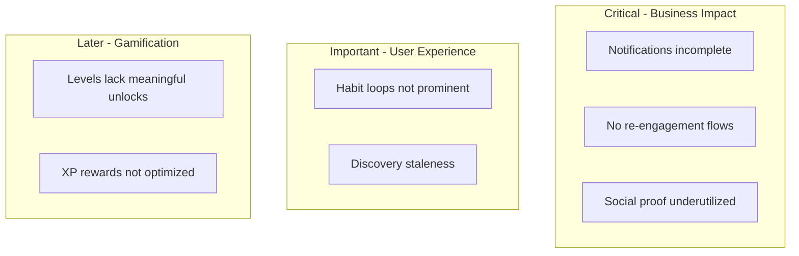
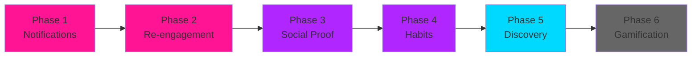

# High Retention Plan for HOTMESS

## Current State Analysis

The platform has strong foundations:

- **Discovery**: Match probability scoring, filters, "Right Now" status, personas
- **Messaging**: Real-time chat, voice notes, read receipts, typing indicators
- **Events**: RSVP, AI recommendations, map view, radio shows
- **Community**: Tribes, posts, following system
- **Safety**: Panic button, fake calls, location sharing

## Retention Gaps Identified (Priority Order)



---

## Phase 1: Fix Core Notification Gaps (CRITICAL)

### 1.1 Add Missing Engagement Notifications

**Problem**: Users don't get notified when someone follows, likes, or views their profile.

**Implementation**:
- `api/social/follow.js` - Add notification on follow action
- `src/pages/Community.jsx` - Add notification on like action  
- `api/profiles.js` - Track profile views, notify at threshold

**Notification Types to Add**:

| Type | Message | Trigger |
|------|---------|---------|
| `new_follower` | "X started following you" | On follow |
| `post_liked` | "X liked your post" | On like (batch: "5 people liked") |
| `profile_views` | "Your profile is getting attention" | 5+ views/day |
| `new_match` | "You matched with X - 87% compatible" | High match score |
| `match_online` | "Your match X is online now" | Match comes online |

### 1.2 Enforce Notification Preferences

**Problem**: `api/notifications/process.js` doesn't check user preferences before sending.

**Fix**: Add preference check before dispatch:

```javascript
// Check preferences before sending
const prefs = await getNotificationPreferences(notification.user_email);
if (!shouldSendNotification(prefs, notification.type)) continue;
```

### 1.3 Push Notification Timing Optimization

**Implementation**:
- Respect quiet hours (default 11pm-8am, user configurable)
- Batch non-urgent notifications (likes, views) into digest
- Immediate for: messages, safety alerts, match online

---

## Phase 2: Re-engagement Flows (HIGH IMPACT)

### 2.1 Dormant User Reactivation

**Trigger**: User hasn't opened app in X days.

| Days Inactive | Notification | Content Type |
|---------------|--------------|--------------|
| 3 days | "Miss you!" | New matches waiting |
| 7 days | "Someone viewed your profile" | Curiosity hook |
| 14 days | "Event this weekend" | FOMO trigger |
| 30 days | "We've improved the app" | Feature announcement |

**Implementation**:
```
api/cron/reactivation.js
├── Query users by last_seen_at tiers
├── Select appropriate message template
├── Check notification preferences
└── Dispatch via existing push system
```

### 2.2 "You're Missing Out" Notifications

**Trigger**: User is subscribed but hasn't engaged recently.

**Content Options**:
- "X users are live Right Now near you"
- "Your match X is online"
- "Event starting in 1 hour: [Event Name]"
- "New people joined in [your area] today"

### 2.3 Weekly Digest Email

For users who prefer email over push:
- "Your week on HOTMESS"
- Profile views, new followers, matches
- Upcoming events near them
- Community highlights

---

## Phase 3: Social Proof & Discovery (MEDIUM IMPACT)

### 3.1 Activity Visibility on Profile Cards

Add to `ProfileCard.tsx`:

| Badge | Criteria | Purpose |
|-------|----------|---------|
| 🔥 Popular | High engagement rate | Social proof |
| ⚡ Hot Right Now | Recent view spike | FOMO |
| 🟢 Recently Active | Active in last 5 min | Availability |
| ✨ New | Joined in last 7 days | Fresh faces |
| 💬 Quick Responder | Fast message replies | Trust signal |

**Implementation**:
```typescript
// In ProfileCard.tsx
{profile.isPopular && <Badge variant="hot">Popular</Badge>}
{profile.viewSpike && <Badge variant="trending">Trending</Badge>}
{profile.lastActive < 5 && <Badge variant="online">Online</Badge>}
```

### 3.2 "Who's Around" Real-time Updates

Enhance the Social page:
- Live counter: "47 people online near you"
- Activity pulse animation for recent activity
- "X just joined" notifications (opt-in)

### 3.3 Match Activity Signals

When viewing a match's profile:
- "Last active 2 hours ago"
- "Usually responds in 10 minutes"
- "Online now" with green indicator

---

## Phase 4: Habit Formation Loops (MEDIUM IMPACT)

### 4.1 Daily Check-in (Simple Version)

**Mechanic**: Tap to claim daily status - no XP focus initially.

**Benefits unlocked by checking in**:
- See who viewed your profile today
- Boost visibility in discovery for 4 hours
- Access to "Right Now" posting

**Implementation**:
```
src/components/retention/DailyCheckin.jsx
├── Simple tap-to-claim UI
├── Shows streak counter
├── Unlocks daily benefits
└── No complex XP calculations
```

### 4.2 Streak System (Lightweight)

Focus on simple streak tracking without heavy rewards:
- Visual streak counter in header
- Milestone acknowledgments (7, 30, 100 days)
- "Streak about to end" reminder push

**Files**:
- `src/Layout.jsx` - Add streak display
- `api/cron/streak-reminder.js` - Prevention notification

### 4.3 Event-Based Engagement

Automatic engagement prompts:
- Friday 5pm: "Weekend plans? See what's happening"
- Post-event: "How was [Event]? Share your experience"
- Pre-event: "Reminder: [Event] is tomorrow"

---

## Phase 5: Discovery Freshness (QUALITY)

### 5.1 Prevent Discovery Staleness

**Problem**: Users see same profiles repeatedly.

**Solutions**:
- Track shown profiles, rotate prioritization
- "Refresh" button to reshuffle grid
- New profiles get temporary boost
- Location-based freshness (traveling users)

### 5.2 Smart Sorting Improvements

Enhance match probability with:
- Activity recency weighting (active users rank higher)
- Response rate factor (users who reply rank higher)
- Mutual interest signals

### 5.3 "Second Chance" Feature

- Profiles user previously skipped
- Resurface after 30 days with "Take another look?"
- Only for profiles that have updated since

---

## Phase 6: Gamification & XP (LATER)

> **Note**: XP and gamification will be expanded once core retention mechanics are proven.

### 6.1 Level-Based Unlocks (Future)

| Level | Unlock | Implementation |
|-------|--------|----------------|
| 3 | Create secondary persona | Feature gate |
| 5 | See profile viewers | Chrome feature |
| 7 | Priority discovery | Sort boost |
| 10 | Custom badge color | Cosmetic |
| 15 | Create private events | Feature unlock |
| 20 | "Legend" status | Badge |

### 6.2 XP Optimization (Future)

- Daily challenge variety
- XP multipliers for streaks
- Seasonal events with bonus XP
- Tribe competitions

---

## Implementation Priority (Updated)



### Sprint Prioritization

| Priority | Task | Impact | Effort |
|----------|------|--------|--------|
| 🔴 P0 | Fix notification preferences check | High | Low |
| 🔴 P0 | Add follow/like/view notifications | High | Low |
| 🔴 P0 | 3-day dormant user reactivation | High | Medium |
| 🟠 P1 | Weekly digest email | High | Medium |
| 🟠 P1 | Social proof badges on cards | Medium | Low |
| 🟠 P1 | Simple daily check-in | Medium | Medium |
| 🟡 P2 | "Match online" notifications | Medium | Low |
| 🟡 P2 | Streak display in header | Low | Low |
| 🟡 P2 | Discovery freshness rotation | Medium | Medium |
| 🟢 P3 | Level unlocks system | Low | High |
| 🟢 P3 | XP optimization | Low | High |

---

## Key Files to Modify

### Critical (Phase 1-2)
- `api/notifications/process.js` - Add preference enforcement
- `api/notifications/dispatch.js` - Add new notification types
- `api/social/follow.js` - Trigger follow notification
- `api/profiles.js` - Add view tracking

### Important (Phase 3-4)
- `src/features/profilesGrid/ProfileCard.tsx` - Social proof badges
- `src/Layout.jsx` - Streak counter in header
- `src/pages/Home.jsx` - Daily check-in card

### New Files to Create

| File | Purpose | Phase |
|------|---------|-------|
| `api/cron/reactivation.js` | Dormant user re-engagement | 2 |
| `api/cron/weekly-digest.js` | Email digest generation | 2 |
| `api/cron/streak-reminder.js` | Streak break prevention | 4 |
| `src/components/retention/DailyCheckin.jsx` | Check-in UI | 4 |
| `api/profile-views.js` | View tracking endpoint | 1 |

---

## Success Metrics

### Primary (Business)
| Metric | Current | Target | Measurement |
|--------|---------|--------|-------------|
| D1 Retention | ? | 60% | % users return next day |
| D7 Retention | ? | 35% | % users return in week |
| D30 Retention | ? | 20% | % users return in month |
| DAU/MAU | ? | 25% | Stickiness ratio |

### Secondary (Engagement)
| Metric | Purpose |
|--------|---------|
| Notification open rate | Message quality |
| Messages per user per day | Core engagement |
| Events RSVPs per user | Feature adoption |
| Match conversations started | Discovery effectiveness |

### Later (Gamification)
| Metric | Purpose |
|--------|---------|
| Streak length distribution | Habit formation |
| XP earned per user per day | Activity depth |
| Level progression rate | Long-term engagement |

---

## Quick Wins Checklist

- [ ] Add preference check to `process.js`
- [ ] Add `new_follower` notification type
- [ ] Add `post_liked` notification type  
- [ ] Add `profile_views` daily summary
- [ ] Create reactivation cron job
- [ ] Add "Popular" badge to ProfileCard
- [ ] Add "Online" indicator to ProfileCard
- [ ] Simple streak counter in header

---

## Notes

1. **XP/Gamification is intentionally deprioritized** - Focus on core retention mechanics that drive real value (notifications, re-engagement, social proof) before layering in gamification rewards.

2. **Notifications are the highest-leverage fix** - Users not knowing about activity = users not returning.

3. **Re-engagement flows have proven ROI** - Push notifications to dormant users are a standard retention playbook.

4. **Social proof drives FOMO** - Showing activity signals encourages engagement loops.

5. **Gamification should enhance, not replace** - XP and levels are sugar on top, not the core meal.
