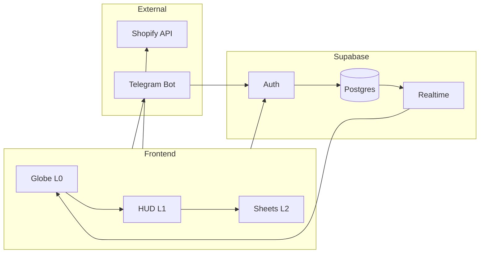
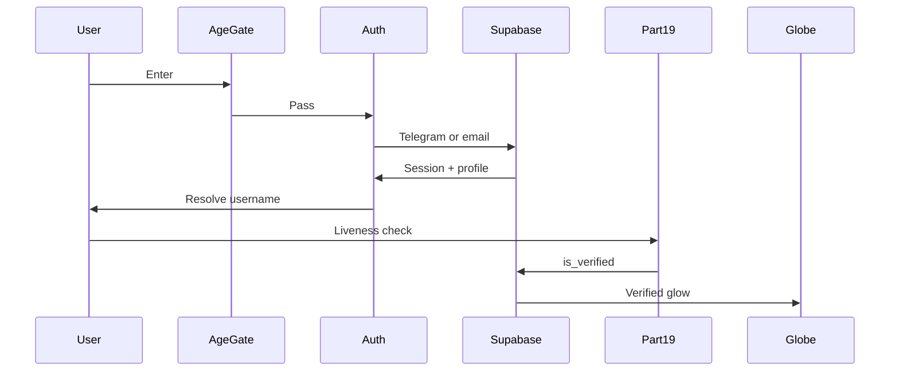
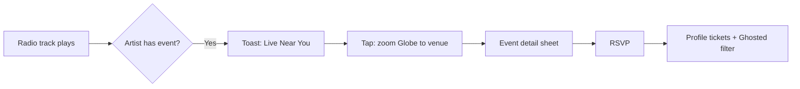
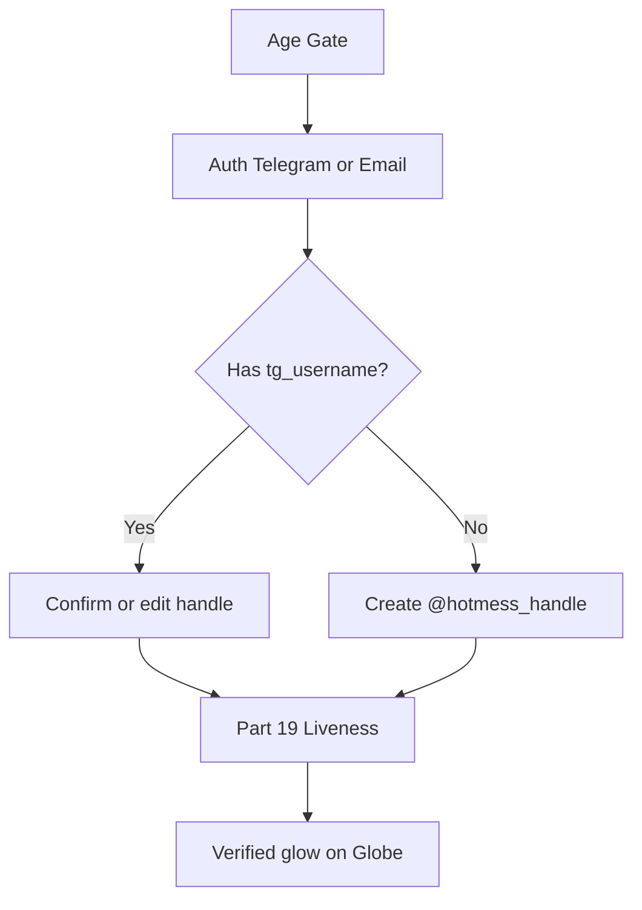
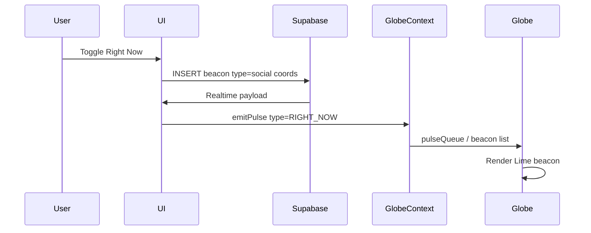
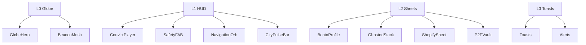

# HOTMESS London OS — Master Remap & Wire-Flow

**Version:** REMAP-MASTER v1.0  
**Date:** 2026-02-08  
**Status:** Developer-ready spec (single source of truth for remap)

---

## Changelog

| Version | Date       | Change |
|---------|------------|--------|
| v1.0    | 2026-02-08 | Initial master remap: architecture, HUD layers, 19 Parts, flows, Pulse contract, schema, checklist, Mermaid diagrams. |

---

## Table of Contents

1. [Executive summary](#1-executive-summary)
2. [System architecture](#2-system-architecture)
3. [Navigation and HUD remap](#3-navigation-and-hud-remap)
4. [Current app ↔ 19 Parts mapping](#4-current-app--19-parts-mapping)
5. [End-to-end user flows](#5-end-to-end-user-flows)
6. [Data and component wire-flow](#6-data-and-component-wire-flow)
7. [Database schema (Supabase)](#7-database-schema-supabase)
8. [Component hierarchy (Figma-style spec)](#8-component-hierarchy-figma-style-spec)
9. [Telegram and identity](#9-telegram-and-identity)
10. [Dual marketplace](#10-dual-marketplace)
11. [Improvements and additions](#11-improvements-and-additions)
12. [Implementation checklist](#12-implementation-checklist)
13. [Visual diagrams (Mermaid)](#13-visual-diagrams-mermaid)
14. [Remap environment variables](#14-remap-environment-variables)
15. [Codebase hygiene (for implementers)](#15-codebase-hygiene-for-implementers)

---

## 1. Executive summary

### Vision

Move from a **website with pages** to a **Spatial OS**:

- **Globe** = desktop (always-on background).
- **Radio** = background task (persistent player).
- **Ghosted / Market / Events** = applications (L2 sheets over the Globe).

Every user action that affects the world (Right Now, RSVP, match, sale, panic) triggers a **Globe pulse** where applicable.

### Current state

- **Deployment:** Vercel (e.g. `hotmess-globe-4snc8efw4-phils-projects-59e621aa.vercel.app`).
- **Scope:** 12 original features (Live Radio, Shows, Schedule, Releases, Artists, Playlists, Countdown, Wetter Watch, Submit Release, Social, Events, Commerce), 19 Parts, ~105 routes, 326 components.
- **Stack:** React 18 + Vite, Tailwind, Framer Motion, TanStack Query, Zustand, Supabase, Shopify Storefront API, Mapbox, Three.js / React Three Fiber.

### Remap outcome

- **Single “London OS” loop:** Globe as L0; HUD L1–L3; all pillar content as overlays/sheets where possible.
- **One data path to the Globe:** `GlobeContext.emitPulse` + Supabase Realtime on `beacons` (see [Data and component wire-flow](#6-data-and-component-wire-flow)).
- **4 Nav Pillars:** THE PULSE, THE VAULT, THE CELL, THE MARKET (see [Navigation and HUD remap](#3-navigation-and-hud-remap)).

---

## 2. System architecture

### Headless triad

| Layer | Technology | Role |
|-------|------------|------|
| **Spatial engine** | Three.js / React Three Fiber + Mapbox GL | Existing Globe (L0); 3D canvas and beacon rendering. |
| **Data / Auth** | Supabase | Auth (incl. Telegram), Postgres, Realtime, Storage. |
| **Official commerce** | Shopify Storefront API | Headless brand stores (HNH MESS, etc.). |
| **P2P marketplace** | Supabase schema (non-Shopify) | Creator/artist resale; Stripe Connect for payments. |
| **Notifications** | Telegram Bot | Globe-triggered alerts (match, sale, safety). |

### Architecture diagram



---

## 3. Navigation and HUD remap

### From routes to modality

- The **Globe never unmounts** when the user is in “London OS” mode; UI is **layers on top**.
- Primary navigation is **modality** (which sheet or overlay is open), not only route path.

### Layer definitions

| Layer | Description | Key components |
|-------|-------------|----------------|
| **L0** | Globe (built) | Persistent 3D canvas; BeaconMesh from `beacons` + WorldPulseContext atmosphere. |
| **L1** | System HUD | ConvictPlayer (bottom), SafetyFAB, NavigationOrb, CityPulseBar / Wetter Watch ticker. |
| **L2** | Contextual sheets/drawers | Profile (Bento/Convict ID), Ghosted stack, Shopify store, P2P Vault, Event detail. |
| **L3** | Overlays / toasts | Match alerts, XP level-up, safety alerts, drop countdowns. |

### 4 Nav Pillars

| Pillar | Parts | User action |
|--------|-------|-------------|
| **THE PULSE** | 6, 11, 13, 17, 18 | Listen live, Wetter Watch, schedule, Pulse Calendar. |
| **THE VAULT** | 13, 14, 15 | Artists, releases, archive, community, submit release. |
| **THE CELL** | 1–3, 5, 8, 9 | Profile, onboarding, rewards, gamification, membership. |
| **THE MARKET** | 7, 10, 15 | Shop (Shopify + P2P), countdowns, tickets. |

### Current vs remap route table

| Current route (primary) | Remap target | Part(s) |
|-------------------------|--------------|---------|
| `/` (Home) | Stays full page; Globe is L0 | 12, 13, 18 |
| `/auth`, `/onboarding`, `/age` | Stay full page (gatekeeper) | 1, 2, 3 |
| `/pulse` | L2 sheet over Globe or dedicated | 18 |
| `/events`, `/events/:id` | Event list full page; detail → L2 sheet over Globe | 6, 18 |
| `/market`, `/market/:collection`, `/market/p/:handle` | L2 sheet (Shopify) over Globe | 7 |
| `/market/creators/*` | L2 sheet (P2P) over Globe | 7 |
| `/social`, `/social/inbox`, `/social/u/:id` | Social grid full page; profile/thread → L2 sheet | 4, 14 |
| `/music`, `/music/live`, `/music/shows`, `/music/releases/*` | Music hub full page; player persistent L1; detail → L2 sheet | 13 |
| `/more` | Stays hub (links to tools) | 12 |
| `/safety/*` | Safety FAB L1; Safety hub can be L2 sheet or full page | 10 |
| `/Profile`, `/EditProfile`, `/settings`, `/membership` | Profile/settings → L2 sheet or full page (phased) | 5, 8, 9 |
| `/biz/*`, `/admin/*`, `/creator/*` | Stay full page (admin/creator tools) | 15, 16 |

### Progressive disclosure

- Open **Radio / Social / Market** sheets **only when the user taps** the corresponding pillar.
- When Globe is home, **no full-page navigations** for pillar content where a sheet is sufficient.

### “Tonight” behaviour

- **Time window:** e.g. 20:00–06:00 local (configurable).
- **What changes:** Stronger Beacon emphasis, Safety FAB more prominent, Wetter Watch ticker default on.
- **Where logic lives:** e.g. `useTonightMode` hook or layout-level logic; document in implementation.

### Max 3 levels rule

- **From Globe, user is never more than 2 taps from:** play, RSVP, message, or safety.

---

## 4. Current app ↔ 19 Parts mapping

### 12 original features → Part(s) and status

| Feature | Part(s) | Status | Wireframe |
|---------|---------|--------|-----------|
| Live Radio | 13 | Built | `wireframes/WIREFRAMES-PART13-MUSIC-DEEP.html` |
| Shows List / Detail / Episodes | 13 | Built | `wireframes/WIREFRAMES-PART13-MUSIC-DEEP.html` |
| Schedule | 18 | Partial | `wireframes/WIREFRAMES-PART18-PULSE-CALENDAR.html` |
| Releases List / Detail | 13, 7 | Built | `wireframes/WIREFRAMES-PART13-MUSIC-DEEP.html`, `WIREFRAMES-PART7-COMMERCE.html` |
| Artists List | 13 | Built | `wireframes/WIREFRAMES-PART13-MUSIC-DEEP.html` |
| Playlists | 13 | Built | `wireframes/WIREFRAMES-PART13-MUSIC-DEEP.html` |
| Pre-Launch Countdown | 11 | Built | — |
| Wetter Watch | 6, 11 | Partial | `wireframes/WIREFRAMES-PART6-EVENTS.html`, `WIREFRAMES-PART11-EXTRAS.html` |
| Submit Release | 15 | Partial | `wireframes/WIREFRAMES-PART15-BUSINESS.html` |
| Social (Ghosted, profiles, messaging) | 4, 14 | Built | `wireframes/WIREFRAMES-PART4-SOCIAL.html`, `WIREFRAMES-PART14-COMMUNITY.html` |
| Events (beacons, RSVP, calendar) | 6, 18 | Built / Partial | `wireframes/WIREFRAMES-PART6-EVENTS.html`, `WIREFRAMES-PART18-PULSE-CALENDAR.html` |
| Commerce (Shopify + P2P) | 7 | Built | `wireframes/WIREFRAMES-PART7-COMMERCE.html` |

### Part status summary

| Part | Name | Status | Wireframe |
|------|------|--------|-----------|
| 2 | Onboarding | Partial | `wireframes/WIREFRAMES-PART3-ONBOARDING.html` (Part 3) |
| 3 | Onboarding | Partial | `wireframes/WIREFRAMES-PART3-ONBOARDING.html` |
| 4 | Social | Built | `wireframes/WIREFRAMES-PART4-SOCIAL.html` |
| 5 | Profile | Built | `wireframes/WIREFRAMES-PART5-PROFILE.html` |
| 6 | Events | Built | `wireframes/WIREFRAMES-PART6-EVENTS.html` |
| 7 | Commerce | Built | `wireframes/WIREFRAMES-PART7-COMMERCE.html` |
| 8 | Gamification | Partial | `wireframes/WIREFRAMES-PART8-GAMIFICATION.html` |
| 9 | Membership | Built | `wireframes/WIREFRAMES-PART9-MEMBERSHIP.html` |
| 10 | Safety | Built | `wireframes/WIREFRAMES-PART10-SAFETY.html` |
| 11 | Extras | Partial | `wireframes/WIREFRAMES-PART11-EXTRAS.html` |
| 12 | Utility | Built | Nav, layout, routing |
| 13 | Music Deep Dive | Built | `wireframes/WIREFRAMES-PART13-MUSIC-DEEP.html` |
| 14 | Community | Built | `wireframes/WIREFRAMES-PART14-COMMUNITY.html` |
| 15 | Business | Partial | `wireframes/WIREFRAMES-PART15-BUSINESS.html` |
| 16 | Admin | Partial | `wireframes/WIREFRAMES-PART16-ADMIN.html` |
| 17 | Microflows | Partial | `wireframes/WIREFRAMES-PART17-MICROFLOWS.html` |
| 18 | Pulse Calendar | Partial | `wireframes/WIREFRAMES-PART18-PULSE-CALENDAR.html` |
| 19 | AI Verification | Planned | `wireframes/WIREFRAMES-PART19-AI-VERIFICATION.html` |

---

## 5. End-to-end user flows

### Flow 1 — Entry and identity

1. **Age Gate** (18+).
2. **Auth:** Telegram primary; email/password or magic link fallback.
3. **Username:** If Telegram provides `tg_username`, use as HOTMESS handle (user can confirm or edit). If `tg_username` is null, **require** a unique `@hotmess_handle` before any social/Globe features.
4. **AI Verification (Part 19):** Liveness selfie → server/edge function → update `profiles.is_verified`; client shows success.
5. **Globe result:** Verified users get **Cyan glow** (#00D9FF) on their beacon.

**Wireframe:** `wireframes/WIREFRAMES-PART3-ONBOARDING.html`, `wireframes/WIREFRAMES-PART19-AI-VERIFICATION.html`



### Flow 2 — Discovery and pulse

- **Home/Globe:** User sees beacons (Lime = Right Now, Cyan = events, Gold = P2P).
- **Radio HUD (L1):** Persistent; BPM/metadata can drive Globe shaders (e.g. pulse frequency).
- **Wetter Watch:** Marquee ticker (L1) with live stats.
- **Pulse Calendar (Part 18):** Time dimension; scrub timeline → Globe beacons filter by time.

### Flow 3 — Social (Ghosted)

1. User toggles **Right Now** → Supabase updates presence/beacons → **Lime beacon** at GPS.
2. Another user taps beacon → **Mini-Profile sheet** (L2) over Globe.
3. **Match / “Say Hi”** → message thread created; **Telegram Bot** notifies recipient (optional).
4. Optional: “Connection line” between two users’ orbs on Globe.

**Wireframe:** `wireframes/WIREFRAMES-PART4-SOCIAL.html`

### Flow 4 — Commerce

- **Official (Shopify):** User opens Market pillar → L2 sheet; data from Shopify Storefront API; checkout via Shopify or headless bridge. “Drop” beacons at brand coordinates when relevant.
- **P2P:** User opens Creators market → L2 sheet; data from Supabase `p2p_listings`; Stripe Connect for payments. Listing creates **Gold beacon** (#FFD700) at seller location.
- **Unified Vault:** Profile/Vault aggregates Shopify orders + P2P purchases (single UI, two data sources).

### Flow 5 — Safety

1. User triggers **Panic** (Safety FAB, L1).
2. **Safety as overlay:** App does **not** navigate away; it flips into **Emergency mode** (red theme, full-screen safety UI).
3. Location shared with trusted contacts; admin/security sees priority beacon.
4. On dismiss, user returns to **same view** (Globe or sheet) they were on.

**Wireframe:** `wireframes/WIREFRAMES-PART10-SAFETY.html`

### Flow 6 — Business / Admin

- **Cadence panel:** Admin triggers “City Signals” (e.g. Globe pulse for all).
- **Wetter Watch CMS:** Live data feed for ticker.
- **AI Verification dashboard:** Override Part 19 results; audit.
- **Moderation:** Reports, content, users.

**Wireframe:** `wireframes/WIREFRAMES-PART16-ADMIN.html`

### Microflow: “From Ear to Floor”



---

## 6. Data and component wire-flow

### Data sources

| Source | Use |
|--------|-----|
| **Supabase** | Auth, profiles, beacons, p2p_listings, messages, event_rsvp, gamification, safety. |
| **Shopify Storefront API** | Official product catalog, cart, checkout. |
| **Telegram** | Auth widget; Bot for notifications. |

### Pulse contract (use existing GlobeContext)

- **All triggers** that affect the Globe call **`emitPulse({ type, coordinates, intensity })`** from [GlobeContext](src/contexts/GlobeContext.jsx).
- The Globe (or a dedicated consumer) **consumes `pulseQueue`** and updates BeaconMesh / shaders.
- **Do not** invent a parallel `usePulse` system; extend GlobeContext or subscribe to Supabase Realtime and then call `emitPulse` so there is **one data path** to the Globe.

### WorldPulseContext vs GlobeContext

- **WorldPulseContext** ([src/contexts/WorldPulseContext.jsx](src/contexts/WorldPulseContext.jsx)): **Ambient layer** — abstract, anonymised signals (city heat, mood, BPM). Drives globe atmosphere and glass feed; no identity.
- **GlobeContext** ([src/contexts/GlobeContext.jsx](src/contexts/GlobeContext.jsx)): **Interactive layer** — mode, focus city, **pulseQueue** for user-driven pulses (Right Now, RSVP, match, sale).
- **Real-time beacons:** Supabase Realtime on `beacons` table → app subscribes and then calls `emitPulse` (or maps rows to BeaconMesh). WorldPulseContext can remain for atmosphere; GlobeContext (or a hook that feeds it) owns beacon list for L0.

### Beacon colours (single source of truth)

Define in code and doc:

```js
const BEACON_COLOR = {
  social: '#39FF14',    // Lime — Right Now
  event: '#00D9FF',     // Cyan — events
  marketplace: '#FFD700', // Gold — P2P listings
  radio: '#B026FF',     // Purple — radio-related (optional)
};
```

Reference this map in component hierarchy and BeaconMesh so colour semantics stay consistent.

### Event types for emitPulse

Document and use consistently: `TRACK_CHANGE`, `RIGHT_NOW`, `RSVP`, `MATCH`, `SALE`, `PANIC`, `NEW_BEACON`, `REMOVE_BEACON`.

### Feature → component → data → Globe trigger

| Feature / module | Component(s) | Data action | Globe trigger |
|-----------------|-------------|-------------|---------------|
| Radio | ConvictPlayer, RadioSchedule | — | TRACK_CHANGE → shader BPM (optional) |
| Right Now | Social, presence toggle | Supabase: beacons insert/delete (type: social) | Lime beacon at coords |
| Events RSVP | EventCard, BeaconDetail | Supabase: event_rsvp; beacons metadata | Beacon size/intensity |
| Ghosted match | GhostedStack, MatchBar | Supabase: message_thread | Optional connection line |
| Shopify purchase | ShopCart, Checkout | Shopify API | Optional “drop” beacon (brand coords) |
| P2P listing | Marketplace, CreatorsCart | Supabase: p2p_listings; beacons insert | Gold beacon at seller |
| Safety panic | SafetyFAB, PanicButton | Supabase: safety alert; location | Red overlay / admin beacon |

### RSVP chain example

Event RSVP → `events/rsvp` (Supabase) → Globe beacon size/intensity updated → Ghosted filter “Who’s going” → XP reward → Safety widget (location share for event) → Profile tickets (digital ticket in Vault).

### Unified Vault API shape

- **Data shape:** e.g. `{ shopifyOrders: Order[], p2pPurchases: Purchase[] }`.
- **Implementation:** Either one React Query key that merges two fetches (Shopify + Supabase) or two keys consumed by a single Vault component. Document choice in implementation.

### Cart consolidation

- **Single cart context for Shopify** only. P2P uses **separate flow** (e.g. Stripe Checkout session); no mixed cart.
- **Shopify cart:** `/market`, `/cart`, `/checkout/start`, `/checkout`; components: ShopCart, CheckoutStart, Checkout.
- **P2P:** `/market/creators`, `/market/creators/cart`, `/market/creators/checkout`; components: CreatorsCart, CreatorsCheckout.
- Collapse any duplicate cart logic so one path is “Shopify” and one is “P2P.”

---

## 7. Database schema (Supabase)

### Remap summary (target schema)

**profiles**

- `id` (uuid, PK), `username` (text, unique), `tg_id` (bigint, unique), `tg_username` (text), `is_verified` (boolean), `xp_level` (int), `persona_type` (enum), `identity_hash` (text, Part 19), plus existing columns.

**beacons**

- `id` (uuid, PK), `user_id` (uuid, FK profiles), `type` (enum: social | event | marketplace | radio), `location` (geography POINT), `metadata` (jsonb), `expires_at` (timestamptz).

**p2p_listings** (non-Shopify)

- `id` (uuid, PK), `seller_id` (uuid, FK profiles), `title` (text), `price` (decimal), `status` (enum: available | escrow | sold), plus listing details.

If `p2p_listings` (or equivalent) does not exist yet, this doc is the **canonical target schema**; reference a future migration, e.g. `supabase/migrations/YYYYMMDD_p2p_listings.sql`.

Existing schema: see [src/components/utils/supabase-schema.sql.jsx](src/components/utils/supabase-schema.sql.jsx) or Supabase migrations if present.

---

## 8. Component hierarchy (Figma-style spec)

### L0 — Core (background)

| Component | Path / note |
|-----------|-------------|
| GlobeHero | [src/components/globe/GlobeHero.jsx](src/components/globe/GlobeHero.jsx) |
| ConvictPlayer (persistent) | Radio player; keep in L1 layout so audio context stays active |

### L1 — System HUD

| Component | Path / note |
|-----------|-------------|
| NavigationOrb / bottom nav | Layout or dedicated component |
| SafetyFAB | [src/pages/Safety.jsx](src/pages/Safety.jsx) or dedicated FAB |
| CityPulseBar | [src/components/globe/CityPulseBar.jsx](src/components/globe/CityPulseBar.jsx) |
| Wetter Watch ticker | Part of CityPulseBar or LiveFeed |

### L2 — Contextual sheets

| Component | Path / note |
|-----------|-------------|
| BentoProfile / Convict ID | Profile view as sheet |
| GhostedStack | Social swipe stack |
| ShopifyProductGrid / ShopCart | [src/pages/Shop.jsx](src/pages/Shop.jsx), ShopCart |
| P2PVault / Marketplace | [src/pages/Marketplace.jsx](src/pages/Marketplace.jsx), ProductDetail |
| EventDetail drawer | [src/pages/BeaconDetail.jsx](src/pages/BeaconDetail.jsx) |

### L3 — Toasts / alerts

| Component | Path / note |
|-----------|-------------|
| Toasts | Sonner (existing) |
| Match alerts, XP, safety | Notification components |

---

## 9. Telegram and identity

- **Login:** Telegram primary (e.g. Telegram Login Widget); email/password or magic link fallback.
- **Username rule:** If `tg_username` is null, **require** a unique `@hotmess_handle` before any social/Globe features. Document explicitly to avoid edge cases.
- **Telegram Bot:** Webhook for Globe-triggered notifications (match, marketplace sale, safety alert) with “Open HOTMESS OS” link. No code in this doc—spec only.

---

## 10. Dual marketplace

| Type | Entry | Data | Payments | Globe |
|------|-------|------|----------|-------|
| **Official (Shopify)** | `/market`, `/market/:collection`, `/market/p/:handle` | Shopify Storefront API | Shopify checkout or headless bridge | Optional “drop” beacons at brand coords |
| **P2P (Supabase)** | `/market/creators`, `/market/creators/p/:id` | Supabase `p2p_listings` | Stripe Connect (or equivalent) | Gold beacon at seller location |

Unified Vault in profile: single UI aggregating Shopify orders + P2P purchases (see [Unified Vault API shape](#unified-vault-api-shape)).

---

## 11. Improvements and additions

- **Unified Vault:** Single “Vault” for both Shopify and P2P purchases (see [Data and component wire-flow](#6-data-and-component-wire-flow)).
- **“Tonight” filter:** UI/theme shift for night window (e.g. 20:00–06:00); stronger Beacons, Safety FAB prominence, Wetter Watch default (see [Navigation and HUD remap](#3-navigation-and-hud-remap)).
- **Real-time Globe:** Supabase Realtime on `beacons` (and optionally profiles) → subscription in app → `emitPulse` or direct BeaconMesh update (document intended behaviour; implement in phases).
- **AI Verification (Part 19):** Liveness check → `profiles.is_verified` + optional `identity_hash`; client shows success and enables **Verified glow** (Cyan) on Globe.
- **Part 19 data flow:** Client captures selfie → server/edge function → liveness result → update `profiles.is_verified` (and optionally `identity_hash`) → client shows success and enables Verified glow.

---

## 12. Implementation checklist

### Phase 1 — Globe alive

- [x] Telegram Auth bridge + profile creation (username resolution).
- [x] Supabase Realtime subscription for `beacons`; wire to Globe (e.g. hook that calls `emitPulse` or updates beacon list).
- [x] Right Now toggle → beacons insert/delete → Lime beacon.
- (Everything else can remain page-based in this phase.)

### Phase 2 — Commerce and Vault

- [ ] BPM/metadata from Radio to Globe shaders (uniforms) if desired.
- [ ] P2P listing → beacons insert → Gold beacon.
- [ ] Unified Vault component (Shopify + Supabase data); clearly separate Shopify and P2P flows.

### Phase 3 — Sheets and nav

- [ ] Refactor nav: Globe as persistent shell; introduce L2 sheets for 2–3 pillars (e.g. Social, Event detail) first.
- [ ] Migrate remaining pillar entry points to sheets where applicable (phased).

### Phase 4 — Safety and Part 19

- [ ] Safety FAB + emergency mode + location share.
- [ ] Telegram Bot webhook for match/sale/safety.
- [ ] Part 19 AI Verification UI + backend hook.
- [ ] Verified glow on Globe for verified users.

### Ongoing / hygiene

- [ ] Single source for route → page key (e.g. `routeConfig` array) to avoid duplicate route entries in [src/App.jsx](src/App.jsx).
- [ ] Lazy-load heavy 3D/Globe code only on routes that show the Globe; keep L1 HUD slim for fast first load.
- [ ] Document and set **Remap env** vars (see [Remap environment variables](#14-remap-environment-variables)).

---

## 13. Visual diagrams (Mermaid)

### 13.1 Architecture (Headless triad + Globe)

See [System architecture](#2-system-architecture) for the flowchart.

### 13.2 User journey — Convict Entry



### 13.3 Data flow — single action to Globe (e.g. Right Now)



### 13.4 Component hierarchy L0 → L3



### 13.5 19 Parts to 4 Pillars

| Pillar | Parts |
|--------|-------|
| **THE PULSE** | 6, 11, 13, 17, 18 |
| **THE VAULT** | 13, 14, 15 |
| **THE CELL** | 1, 2, 3, 5, 8, 9 |
| **THE MARKET** | 7, 10, 15 |

---

## 14. Remap environment variables

Document and set as needed for remap features:

| Variable | Purpose |
|----------|---------|
| `VITE_SUPABASE_URL` | Supabase project URL |
| `VITE_SUPABASE_ANON_KEY` | Supabase anon key (client) |
| `SUPABASE_SERVICE_ROLE_KEY` | Server/edge only; never expose to client |
| `VITE_TELEGRAM_BOT` / `TELEGRAM_BOT_TOKEN` | Telegram Login Widget + Bot webhook |
| `SHOPIFY_STOREFRONT_TOKEN` or equivalent | Shopify Storefront API |
| `SHOPIFY_STORE_DOMAIN` | Shopify store domain |
| `VITE_MAPBOX_TOKEN` | Mapbox GL (if used with Globe) |

Add a short “Remap env” subsection in [START_HERE.md](START_HERE.md) or keep this table as the reference so “it works in spec but we’re missing TG bot key” is avoided.

---

## 15. Codebase hygiene (for implementers)

- **Route vs page key:** [src/App.jsx](src/App.jsx) has many `PageRoute` / `createPageUrl` usages and some duplicate route entries (e.g. `/more/beacons` appears twice). When refactoring toward the remap, consider a **single source** of route → page key (e.g. a `routeConfig` array) and derive `<Route>` and `createPageUrl` from it.
- **Globe dependencies:** Home currently pulls in GlobeHero, CityPulseBar, LiveFeed, and release beacons. When making Globe the persistent shell, consider **lazy-loading** heavy 3D/globe code only on routes that show the Globe, and keep L1 HUD (player, safety, nav) in a slim layout so first load stays fast.
- **Env and secrets:** See [Remap environment variables](#14-remap-environment-variables); document in this doc and optionally in START_HERE.md.

---

**End of REMAP-MASTER v1.0**
