# HOTMESS OS — Navigation Map
**Generated:** 2026-02-26
**Version:** Post-Community Features Build

---

## ARCHITECTURE OVERVIEW

```
┌─────────────────────────────────────────────────────────────────────┐
│                        HOTMESS OS SHELL                             │
│  ┌─────────────────────────────────────────────────────────────┐   │
│  │                     MODE VIEWPORT                            │   │
│  │   (HomeMode | GhostedMode | PulseMode | MarketMode | etc)   │   │
│  └─────────────────────────────────────────────────────────────┘   │
│  ┌─────────────────────────────────────────────────────────────┐   │
│  │                   SHEET LAYER (z-80)                         │   │
│  │         L2 Sheets stack here, max 85dvh                      │   │
│  └─────────────────────────────────────────────────────────────┘   │
│  ┌─────────────────────────────────────────────────────────────┐   │
│  │                  BOTTOM NAV (fixed)                          │   │
│  │   [Home] [Ghosted] [Pulse] [Market] [Radio] [Profile]       │   │
│  └─────────────────────────────────────────────────────────────┘   │
└─────────────────────────────────────────────────────────────────────┘
```

---

## BOTTOM NAV → MODES

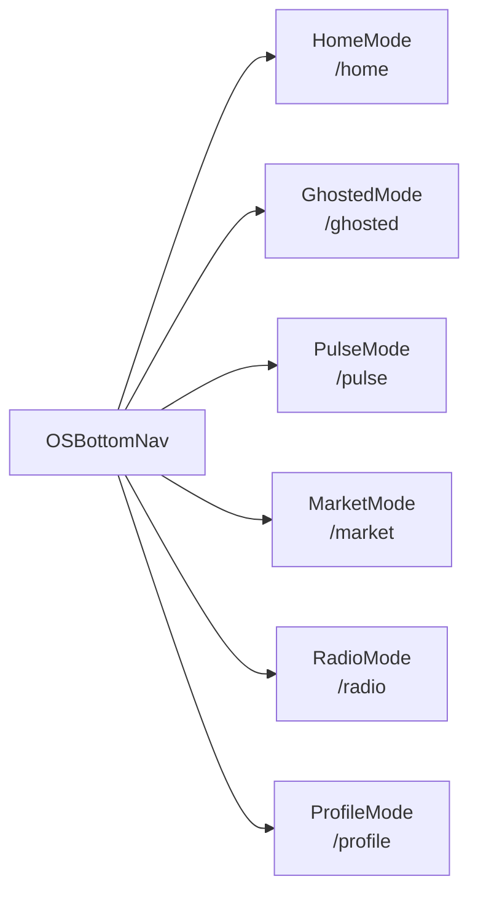

---

## MODE → SHEET NAVIGATION

### HomeMode (/)
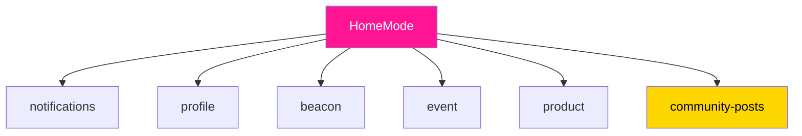

### GhostedMode (/ghosted)
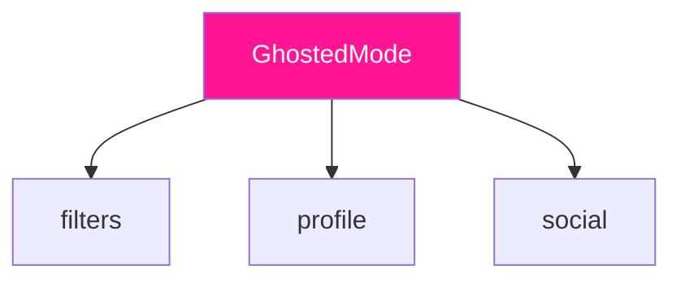

### ProfileMode (/profile)
```mermaid
graph TD
    PROFILE[ProfileMode] --> EDIT[edit-profile]
    PROFILE --> PHOTOS[photos]
    PROFILE --> SETTINGS[settings]
    PROFILE --> PRIVACY[privacy]
    PROFILE --> LOCATION[location]
    PROFILE --> BLOCKED[blocked]
    PROFILE --> EMERGENCY[emergency-contact]
    PROFILE --> HELP[help]
    PROFILE --> MEMBERSHIP[membership]
    PROFILE --> FAVORITES[favorites]
    PROFILE --> NOTIF[notifications]
    PROFILE --> VAULT[vault]
    PROFILE --> ORDERS[my-orders]
    PROFILE --> LISTINGS[my-listings]
    
    subgraph "NEW ACTIVITY SECTION"
        PROFILE --> COMMUNITY[community]
        PROFILE --> ACHIEVEMENTS[achievements]
        PROFILE --> SQUADS[squads]
        PROFILE --> SWEATCOINS[sweat-coins]
        PROFILE --> CREATORHUB[creator-subscription]
    end
    
    style PROFILE fill:#ff1493,color:#fff
    style COMMUNITY fill:#ffd700,color:#000
    style ACHIEVEMENTS fill:#ffd700,color:#000
    style SQUADS fill:#ffd700,color:#000
    style SWEATCOINS fill:#ffd700,color:#000
    style CREATORHUB fill:#ffd700,color:#000
```

### MarketMode (/market)
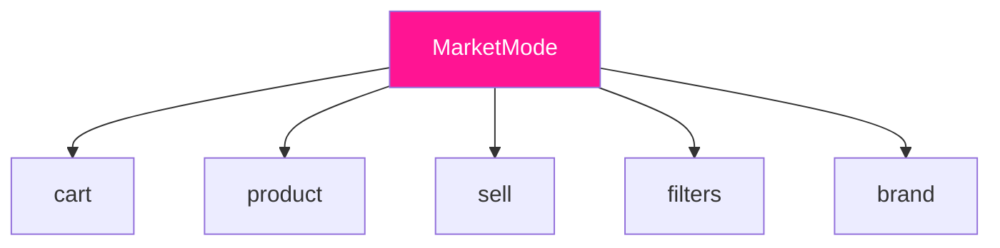

### PulseMode (/pulse)
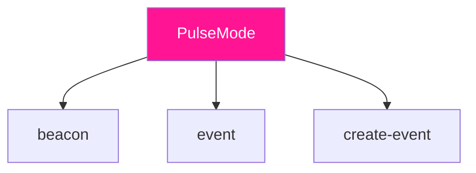

### RadioMode (/radio)
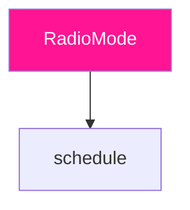

---

## COMPONENT HIERARCHY

```
OSShell
├── BootGuard (auth + onboarding gates)
│   ├── AgeGate
│   └── OnboardingGate
├── OSBottomNav
│   └── [6 mode buttons]
├── ModeViewport
│   ├── HomeMode
│   │   ├── RightNowSection
│   │   ├── CommunitySection ← NEW
│   │   ├── EventsSection
│   │   └── FeaturedSection
│   ├── GhostedMode
│   │   ├── FilterBar
│   │   └── ProfileGrid (3-col)
│   ├── PulseMode
│   │   ├── UnifiedGlobe (3D)
│   │   └── CityPulseBar
│   ├── MarketMode
│   │   ├── CategoryTabs
│   │   └── ProductGrid
│   ├── RadioMode
│   │   ├── ConvictPlayer
│   │   └── ShowSchedule
│   └── ProfileMode
│       ├── ProfileHeader
│       ├── StatsRow
│       ├── ActivitySection ← NEW (5 buttons)
│       └── SettingsSection
├── SheetRouter
│   └── L2*Sheet (32+ sheets)
├── RadioMiniPlayer (persistent)
├── SOSOverlay (z-200)
├── FakeCallOverlay (z-200)
└── ToastContainer (z-110)
```

---

## SHEET REGISTRY (32 sheets)

| Sheet ID | Component | Trigger From | CTA |
|----------|-----------|--------------|-----|
| `achievements` | L2AchievementsSheet | ProfileMode | View gallery |
| `amplify` | L2AmplifySheet | BeaconDetail | Boost beacon |
| `beacon` | L2BeaconSheet | PulseMode, HomeMode | View/Create beacon |
| `blocked` | L2BlockedSheet | ProfileMode | Manage blocks |
| `brand` | L2BrandSheet | MarketMode | View brand |
| `cart` | L2CartSheet | MarketMode | Checkout |
| `checkout` | L2CheckoutSheet | CartSheet | Pay |
| `community` | L2CommunityPostSheet | HomeMode, ProfileMode | View/Create posts |
| `create-event` | L2CreateEventSheet | PulseMode | Create event |
| `creator-subscription` | L2CreatorSubscriptionSheet | ProfileMode | Subscribe/Manage |
| `edit-profile` | L2EditProfileSheet | ProfileMode | Edit profile |
| `emergency-contact` | L2EmergencyContactSheet | ProfileMode | Add contacts |
| `event` | L2EventSheet | HomeMode, PulseMode | RSVP |
| `events` | L2EventsSheet | HomeMode | Browse events |
| `favorites` | L2FavoritesSheet | ProfileMode | View saved |
| `filters` | L2FiltersSheet | GhostedMode, MarketMode | Apply filters |
| `help` | L2HelpSheet | ProfileMode | Get help |
| `location` | L2LocationSheet | ProfileMode | Update location |
| `marketplace` | L2MarketplaceSheet | MarketMode | P2P listings |
| `membership` | L2MembershipSheet | ProfileMode | Upgrade |
| `my-listings` | L2SellSheet | ProfileMode | Manage listings |
| `my-orders` | L2MyOrdersSheet | ProfileMode | Order history |
| `notifications` | L2NotificationsSheet | HomeMode, ProfileMode | View notifs |
| `photos` | L2PhotosSheet | ProfileMode | Manage photos |
| `privacy` | L2PrivacySheet | ProfileMode | Privacy settings |
| `product` | L2ShopSheet | MarketMode | Buy product |
| `profile` | L2ProfileSheet | GhostedMode, HomeMode | View profile |
| `qr` | L2QRSheet | VaultMode | Show QR |
| `sell` | L2SellSheet | MarketMode | List item |
| `settings` | L2SettingsSheet | ProfileMode | App settings |
| `social` | L2SocialSheet | GhostedMode | Social links |
| `squads` | L2SquadsSheet | ProfileMode | Manage squads |
| `sweat-coins` | L2SweatCoinsSheet | ProfileMode | View wallet |
| `vault` | L2VaultSheet | ProfileMode | Tickets/Passes |

---

## USER FLOWS

### Flow 1: Discovery → Match → Chat
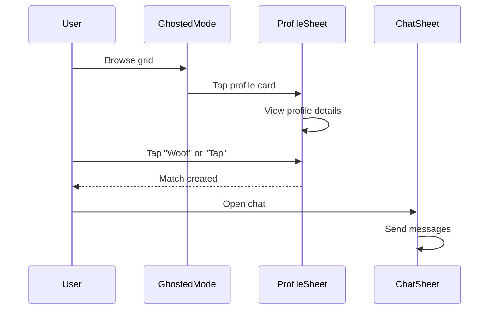

### Flow 2: Event Discovery → RSVP → Check-in
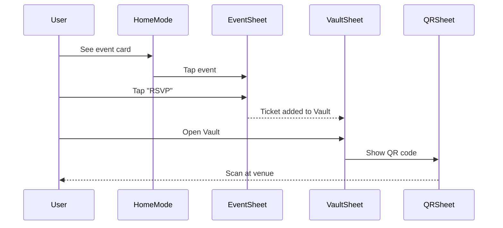

### Flow 3: Shop → Cart → Checkout
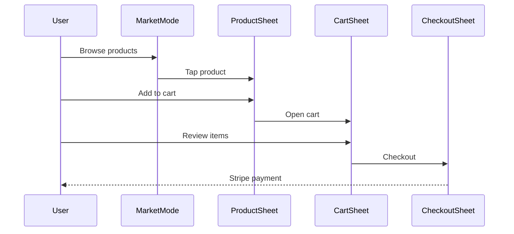

### Flow 4: Community Post Creation
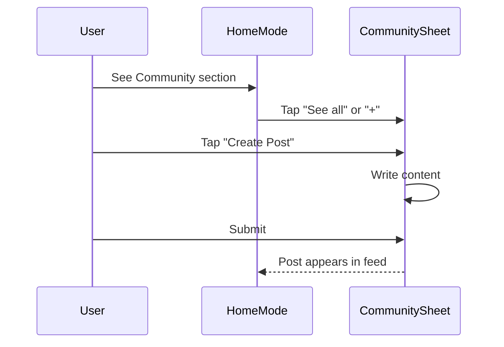

### Flow 5: Creator Subscription
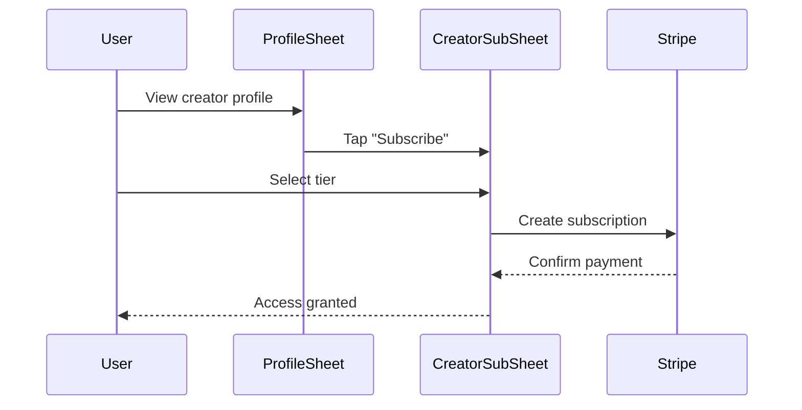

---

## CTA INVENTORY

| Location | CTA Text | Action | Sheet/Route |
|----------|----------|--------|-------------|
| HomeMode | "See all" (Community) | Open feed | `community` |
| HomeMode | "Post" (empty state) | Create post | `community` |
| HomeMode | Event card | View event | `event` |
| GhostedMode | Profile card | View profile | `profile` |
| GhostedMode | Filter icon | Open filters | `filters` |
| ProfileMode | "Edit Profile" | Edit | `edit-profile` |
| ProfileMode | "Achievements" | Gallery | `achievements` |
| ProfileMode | "Squads" | Squad list | `squads` |
| ProfileMode | "Sweat Coins" | Wallet | `sweat-coins` |
| ProfileMode | "Subscriptions" | Manager | `creator-subscription` |
| MarketMode | "Add to Cart" | Add item | Cart state |
| MarketMode | Cart icon | View cart | `cart` |
| MarketMode | "Sell" | List item | `sell` |
| PulseMode | Beacon marker | View beacon | `beacon` |
| PulseMode | "+" FAB | Create event | `create-event` |
| ProfileSheet | "Woof" | Super-like | Taps table |
| ProfileSheet | "Tap" | Like | Taps table |
| ProfileSheet | "Message" | Open chat | `chat` |
| CartSheet | "Checkout" | Pay | `checkout` |
| EventSheet | "RSVP" | Attend | event_rsvps |

---

## Z-INDEX LAYERS

```
z-999  Debug overlays
z-200  Emergency (SOS, FakeCall)
z-120  Interrupts (AgeGate)
z-110  Toasts
z-100  Modals
z-80   Sheets (L2*)
z-50   HUD elements
z-0    Base content
```

---

## FIGMA MCP SETUP

To enable Figma integration in Claude Code:

```bash
# Install Figma MCP server
npx @anthropic-ai/create-mcp@latest

# Or add to your MCP config:
cat >> ~/.cursor/mcp.json << 'EOF'
{
  "mcpServers": {
    "figma": {
      "command": "npx",
      "args": ["-y", "@anthropic-ai/mcp-server-figma"],
      "env": {
        "FIGMA_ACCESS_TOKEN": "YOUR_FIGMA_TOKEN_HERE"
      }
    }
  }
}
EOF
```

Get your Figma token: https://www.figma.com/developers/api#access-tokens

---

## LEGEND

- 🟢 **Pink fill** = Mode (page)
- 🟡 **Gold fill** = New component (just added)
- ➡️ **Arrow** = Navigation
- 📦 **Box** = Component
